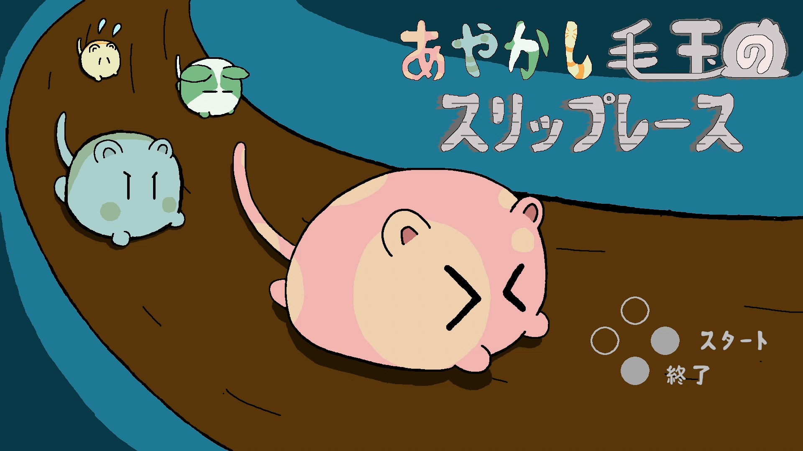
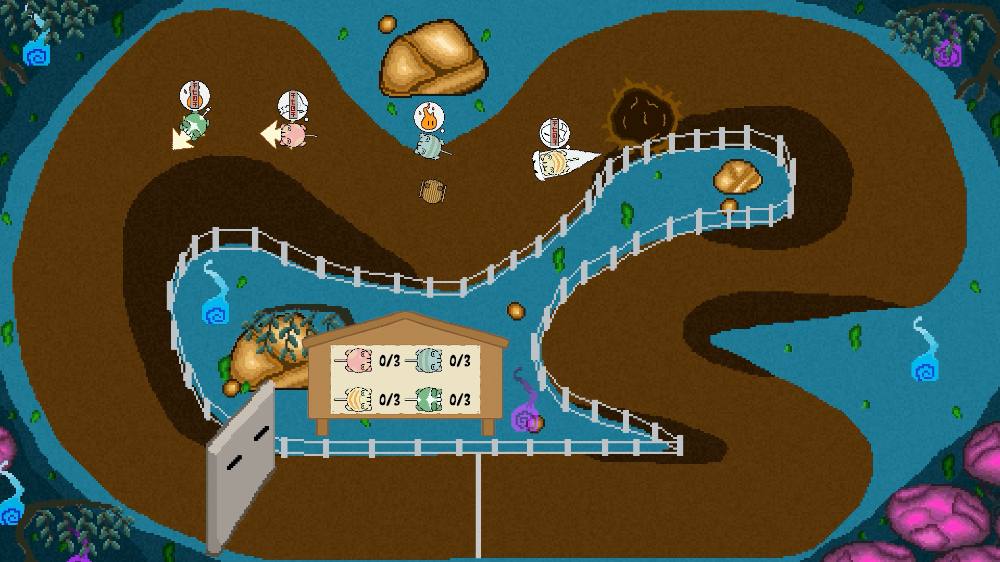
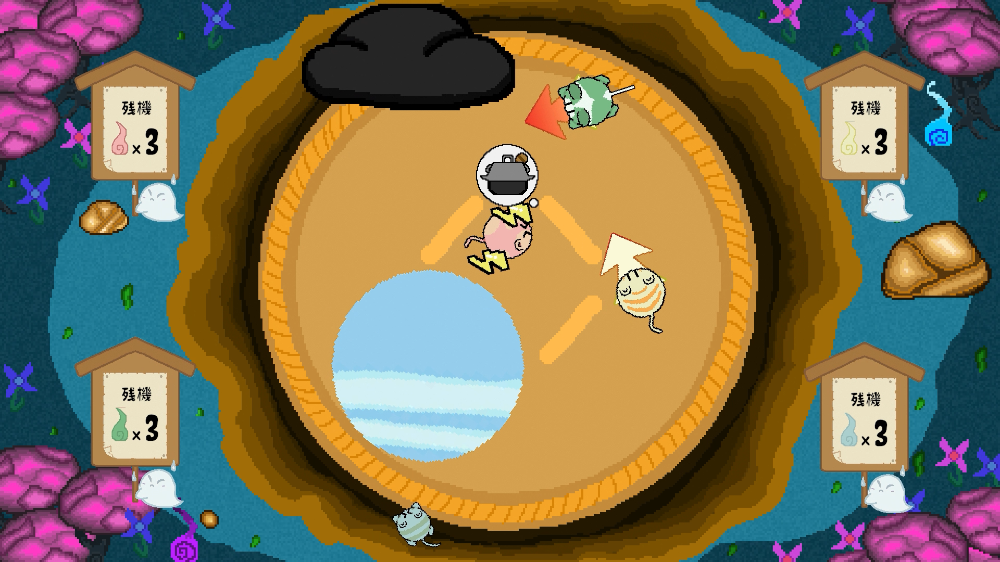
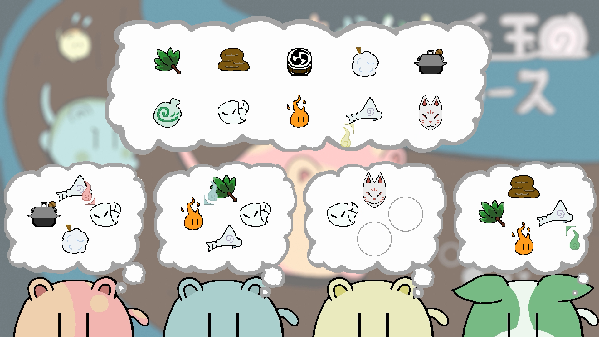
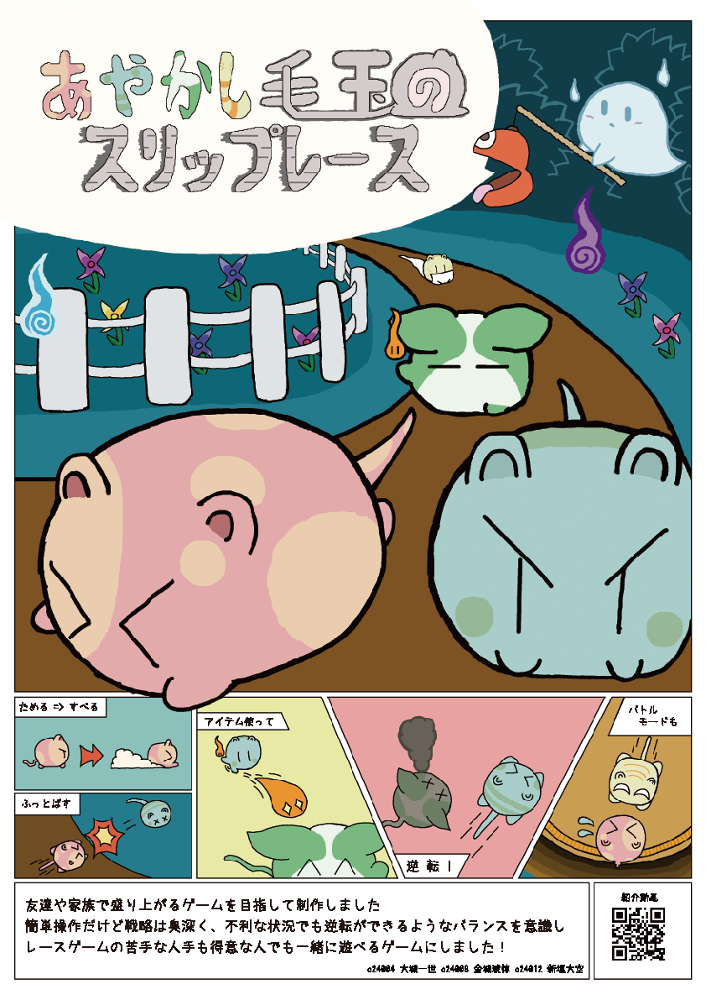

# 「あやかし毛玉のスリップレース」

## Download
* [SlipRace_ver2.3](https://github.com/c24012/SmashRaceGame-Release/releases/tag/v2.3)

## ゲーム概要  

### ジャンル  
パーティーレースゲーム

### ゲームルール  
妖怪「あやかし毛玉」を操作して一番にゴールするのが目的  
ぶつかってライバルを吹っ飛ばしたり、どうぐを駆使して逆転を狙ったりしながら１位を目指そう

### プラットフォーム  
Windows + PCコントローラー（人数分）  
※キーボード操作可能（非推奨）

### Unityバージョン  
Unity 2022.3.24f1

### 紹介動画

## 制作での工夫

### 企画
* レースの爽快感とパーティーの混沌性のどちらも出したかったため、技量で差が出過ぎないほどのスピード感とゲームテンポやシンプルさを重視しました
* 時間の都合上マップを１つしか作れず物足りなさを感じたため、イラストやシステムを再利用しつつ短時間で、落としあいがメインのバトルモードを追加することにしました

### デザイン
* イラスト担当がいない状態での制作だったので、必要なイラストの量をなるべく少なくor簡易的にして制作しました  
* 妖怪をモチーフにしたテーマのパーティーゲームなので、暗めな色を中心にしつつ、明るめなタッチを取り入れたデザインになりました

### プログラム
* キャラクターの挙動やどうぐの挙動は親クラスとしてベースを作り、派生として各機能を追加していくことで要素の追加やデバッグを行いやすくすることを意識しました
* レースでは各プレイヤーがどこにいて、コース全体の何割進んでいるのかを取得する必要があったため、コースに沿った曲線(SplinesPackage)を生成し、プレイヤーと曲線の位置関係をもとに算出するようにしました

## 制作概要  
### メンバー（役割）  
* 金城 琥惇 (デザイン)
* 大城 一世 (プログラム・デザイン)
* 新垣 大空 (プログラム)

### 制作期間
３か月

## スクリーンショット  
  
  
 

